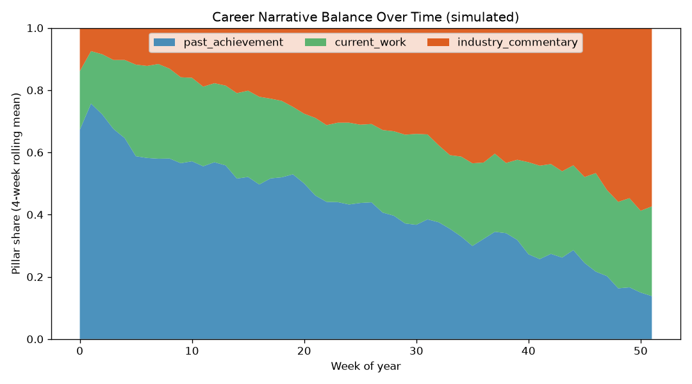

# Career Narrative Signal Tracker

Doing brilliant work quietly is a losing strategy in a changing industry. This repo treats your career narrative like a dataset: measurable, trackable, and improvable.

## Demo Output



The figure above was produced from **simulated** career-post data by `demo.py`, showing how three content pillars evolve over time.

## Why This Exists

Most scientists have no idea whether their public output is balanced. They over-index on one pillar (usually shipping papers into the void) and neglect the others. This tool scores your posts against three pillars:

1. **Past achievements** — what you have shipped.
2. **Current work / learning** — what you are building now.
3. **Industry commentary** — thoughtful takes on where the field is going.

A healthy narrative touches all three. This repo makes the imbalance visible.

## When NOT to Use This

- If you have zero public footprint, go write something first. You cannot analyse an empty corpus.
- If you think keyword counting equals influence. It does not. This is a directional signal, not a truth oracle.
- If you want it to write your posts for you. It measures; you still have to do the thinking.

## The Uncomfortable Truth

Visibility is not vanity. A brilliant result nobody knows about has the same career impact as a result that does not exist. But visibility without substance collapses the moment someone reads closely.

## Decision Framework

| Your situation | Dominant pillar | What to do next |
|---|---|---|
| Just finished a big project | Past achievements | Add current-work and commentary posts |
| Heads-down learning new skills | Current work | Reflect publicly on wins already banked |
| Loud opinions, thin track record | Commentary | Anchor takes to concrete achievements |
| Balanced across all three | None | Increase cadence, not category |

## How It Works

`classify_pillars.py` scores each text against keyword lexicons for the three pillars, normalises the scores, and assigns a dominant pillar. `demo.py` simulates a year of posts and plots pillar balance over time.

```bash
pip install -r requirements.txt
python demo.py
python classify_pillars.py --input my_posts.csv
```

## Failure Modes (Be Honest)

- Keyword lexicons miss sarcasm, context, and jargon drift. Treat scores as a prompt for reflection, not a grade.
- Short posts get noisy scores. Aggregate weekly, not per-post.
- The tool cannot measure whether anyone actually cares. Engagement is a separate, harder problem.

## Hard Truth

You can optimise the balance of your narrative all you want, but if the underlying work is not strong, no amount of strategic posting will save you. Fix the substance first, then measure the signal.

## Further Reading

Inspired by Ming 'Tommy' Tang, "Owning Your Career Narrative in a Changing Industry (SAPA-NE x Moderna Panel)" (https://divingintogeneticsandgenomics.com/talk/2026-moderna-career-panel/).
